```mermaid
flowchart LR
  %% API Gateway
  APIGW[API Gateway]

  %% Services and their storage
  subgraph OrderService["Order Service"]
    direction TB
    OrderApp[Order Application]
    OrderDB[(Order RDBMS)]
    OrderMsg[(Order MESSAGE table)]
  end

  subgraph CustomerService["Customer Service"]
    direction TB
    CustomerApp[Customer Application]
    CustomerDB[(Customer RDBMS)]
    CustomerMsg[(Customer MESSAGE table)]
  end

  subgraph OrderHistoryService["Order History Service (CQRS)"]
    direction TB
    HistoryApp[Order History App]
    Mongo[(MongoDB CQRS view)]
  end

  %% Eventuate Tram CDC and Kafka
  CDC[Eventuate Tram CDC]
  Kafka[Apache Kafka]
  EventBus((Event Bus / Kafka topics))

  %% API routes
  APIGW -->|HTTP: /orders| OrderApp
  APIGW -->|HTTP: /customers| CustomerApp
  APIGW -->|HTTP: /customers/id/orderhistory| HistoryApp

  %% Transactional publish (write + events)
  OrderApp -->|JPA transaction: persist Order + insert event&#40;s&#41;| OrderDB
  OrderApp -->|in same TX: insert domain event&#40;s&#41;| OrderMsg

  CustomerApp -->|JPA transaction: persist Customer + insert event&#40;s&#41;| CustomerDB
  CustomerApp -->|in same TX: insert domain event&#40;s&#41;| CustomerMsg

  %% CDC reads MESSAGE tables and publishes to Kafka
  OrderMsg -->|binlog/WAL| CDC
  CustomerMsg -->|binlog/WAL| CDC
  CDC -->|publish| Kafka
  Kafka -->|topics| EventBus

  %% Subscribers (choreography)
  EventBus -->|OrderCreated, CreditReserved, ...| CustomerApp
  EventBus -->|CreditReserved, CreditLimitExceeded, ...| OrderApp
  EventBus -->|order/customer domain events| HistoryApp

  %% Saga flow example (Create Order choreography)
  %% Dotted lines represent the logical Saga flow between the existing components
  OrderApp -.->|OrderCreated event| CustomerApp
  CustomerApp -.->|CreditReserved or CreditLimitExceeded event| OrderApp
  OrderApp -.->|Update order state APPROVED/REJECTED| OrderDB
```

# Eventuate Tram - Customers and Orders (Architecture)

This diagram shows the runtime architecture of the Customers & Orders example: services, transactional event publishing (Eventuate Tram), CDC → Kafka, and the CQRS read model.



## Components (brief)
- **API Gateway**: single entry point forwarding client HTTP requests to services and the Order History query endpoint.
- **Order Service**: owns Order aggregate (RDBMS), publishes Order domain events transactionally (MESSAGE table).
- **Customer Service**: owns Customer aggregate (RDBMS), reserves customer credit in reaction to OrderCreated events and publishes resultant events.
- **Eventuate Tram MESSAGE table + CDC**: events are inserted into each service's MESSAGE table inside the local DB transaction; the CDC component reads those inserts from the DB binlog/WAL and forwards them to Kafka.
- **Kafka (Event Bus)**: carries domain events to subscribing services (choreography) and to the Order History service.
- **Order History Service**: subscribes to events and maintains a MongoDB-based CQRS read model for customer order history.

## How the Create-Order saga (choreography) runs
1. Client → API Gateway → Order Service creates Order (state PENDING) and writes an OrderCreated event into the service MESSAGE table inside same DB transaction.
2. CDC reads the Message insert and publishes OrderCreated to Kafka.
3. Customer Service consumes OrderCreated, attempts to reserve credit and emits either CreditReserved or CreditLimitExceeded (written transactionally into its MESSAGE table).
4. CDC picks up that event and publishes it to Kafka; Order Service consumes it and updates the Order to APPROVED or REJECTED.

## How to run locally (short)
The repository provides Gradle tasks that start required containers (DBs, Kafka, Mongo) and all services:

```bash
# MySQL-backed run
./gradlew :end-to-end-tests:runApplicationMySQL

# Postgres-backed run
./gradlew :end-to-end-tests:runApplicationPostgres
```

The tasks start containers on unique ports and print a home page with links to the Swagger UIs and the API Gateway. See the repository's README.adoc for more detailed deployment options (Kubernetes, Shell, Docker Compose).

## Notes
- Each service uses its own relational database and MESSAGE table; CDC runs separately and publishes events from all services to Kafka.
- The diagram is intentionally simplified for clarity; the real repo also includes deployment manifests, Terraform, and helper scripts (see `deployment/`, `aws-fargate-terraform/`, and `docker-compose/`).# Eventuate Tram - Customers and Orders (Architecture)

This diagram shows the runtime architecture of the Customers & Orders example: services, transactional event publishing (Eventuate Tram), CDC → Kafka, and the CQRS read model.


## Components (brief)
* **API Gateway**: single entry point forwarding client HTTP requests to services and the Order History query endpoint.
* **Order Service**: owns Order aggregate (RDBMS), publishes Order domain events transactionally (MESSAGE table).
* **Customer Service**: owns Customer aggregate (RDBMS), reserves customer credit in reaction to OrderCreated events and publishes resultant events.
* **Eventuate Tram MESSAGE table + CDC**: events are inserted into each service's MESSAGE table inside the local DB transaction; the CDC component reads those inserts from the DB binlog/WAL and forwards them to Kafka.
* **Kafka (Event Bus)**: carries domain events to subscribing services (choreography) and to the Order History service.
* **Order History Service**: subscribes to events and maintains a MongoDB-based CQRS read model for customer order history.

## How the Create-Order saga (choreography) runs
1. Client → API Gateway → Order Service creates Order (state PENDING) and writes an OrderCreated event into the service MESSAGE table inside same DB transaction.
2. CDC reads the Message insert and publishes OrderCreated to Kafka.
3. Customer Service consumes OrderCreated, attempts to reserve credit and emits either CreditReserved or CreditLimitExceeded (written transactionally into its MESSAGE table).
4. CDC picks up that event and publishes it to Kafka; Order Service consumes it and updates the Order to APPROVED or REJECTED.

## How to run locally (short)
The repository provides Gradle tasks that start required containers (DBs, Kafka, Mongo) and all services:

```bash
# MySQL-backed run
./gradlew :end-to-end-tests:runApplicationMySQL

# Postgres-backed run
./gradlew :end-to-end-tests:runApplicationPostgres
```

The tasks start containers on unique ports and print a home page with links to the Swagger UIs and the API Gateway. See the repository's README.adoc for more detailed deployment options (Kubernetes, Shell, Docker Compose).

## Notes
* Each service uses its own relational database and MESSAGE table; CDC runs separately and publishes events from all services to Kafka.
* The diagram is intentionally simplified for clarity; the real repo also includes deploym
